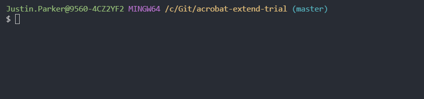

# acrobat-extend-trial
For those times when your `Adobe Acrobat Pro DC` trial has ended and you just need a bit longer to evaluate 😇.  The `trial` period can be reset by changing the trial serial numbers held in the `application.xml` files.

This simple node app will:

- extract your current trial serial numbers from your `application.xml` files
- increment the trial number by 10
- update your `application.xml` files with the new trial serial number

The path to `application.xml` files is held in config.json.

## install

- run `npm install` to install required npm packages

## configuration

- double check the paths to your `application.xml` files match the `config.json` config file

## run app

- run `node app`

